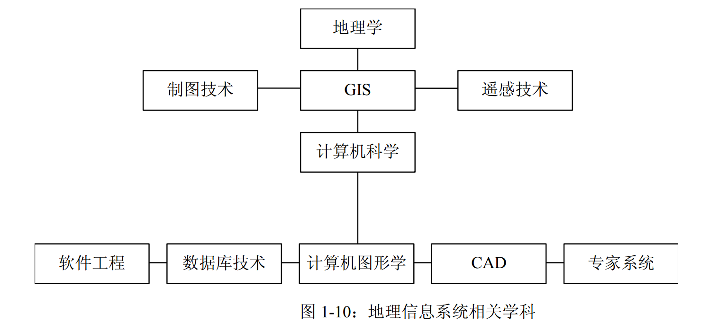

# WebGIS 开发入门

将技术的原理、业界使用情况、在咱们公司的现状或者结合点、后续趋势都能够阐述出来。

## 什么是 WebGIS

GIS + WWW = Web GIS

Web: 不用解释

GIS: 重点解释GIS

geographic information systems 
geographic information science
地理信息系统（科学）

短视频：https://www.bilibili.com/video/av17091140

交叉学科

## 关键技术及原理

### 数据

结构化数据（关系表） & 半结构化数据（对象属性不固定） & 非结构化数据（图片、视屏、音频）

数据类型

- 矢量
  * 点
  * 线
  * 面

- 栅格
  * 影响
  * DEM

### 坐标系与投影

聊聊GIS中那些坐标系：
https://www.cnblogs.com/onsummer/p/7451128.html

### 地图服务

### 空间分析与可视化

## 应用和展望

## 参考资料

https://www.cnblogs.com/onsummer/p/7451128.html

https://cntchen.github.io/2016/05/09/%E5%9B%BD%E5%86%85%E4%B8%BB%E8%A6%81%E5%9C%B0%E5%9B%BE%E7%93%A6%E7%89%87%E5%9D%90%E6%A0%87%E7%B3%BB%E5%AE%9A%E4%B9%89%E5%8F%8A%E8%AE%A1%E7%AE%97%E5%8E%9F%E7%90%86/

https://www.cnblogs.com/arxive/p/6017260.html

https://www.wolfram.com/language/11/geo-computation/cartographic-geo-projections.zh.html

https://zhuanlan.zhihu.com/p/24981976

https://cntchen.github.io/2016/05/09/%E5%9B%BD%E5%86%85%E4%B8%BB%E8%A6%81%E5%9C%B0%E5%9B%BE%E7%93%A6%E7%89%87%E5%9D%90%E6%A0%87%E7%B3%BB%E5%AE%9A%E4%B9%89%E5%8F%8A%E8%AE%A1%E7%AE%97%E5%8E%9F%E7%90%86/

坐标转化库：（误差在10米左右）
https://github.com/wandergis/coordtransform

瓦片地图原理：
https://segmentfault.com/a/1190000011276788
https://www.maptiler.com/google-maps-coordinates-tile-bounds-projection/

